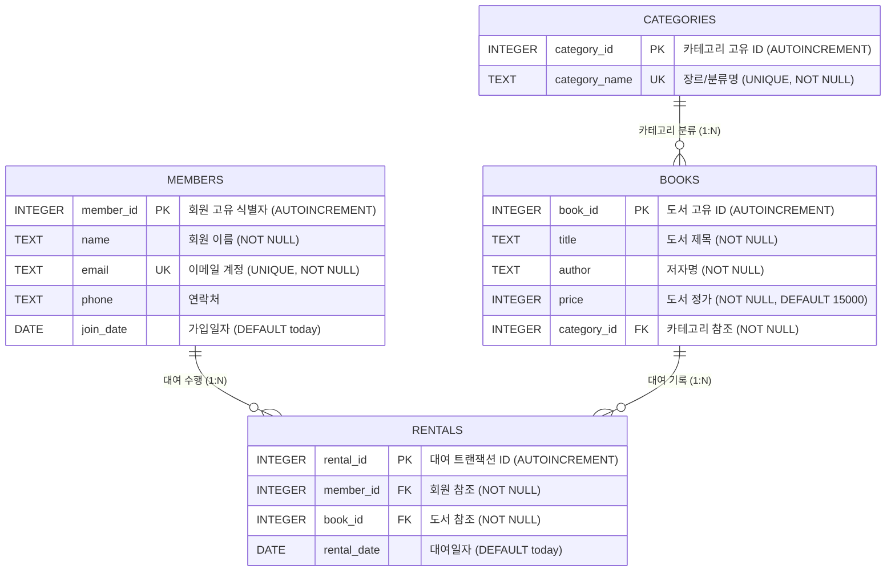

# 📊 SQL 기반 도서 관리 시스템 (Book Management System)

> **과제명**: 정보를 깔끔하게 정리하는 디지털 서랍장 만들기 (미션 5-1: SQL로 만드는 나만의 데이터베이스)  
> **수행자**: gdone9009 (gdone9009@gmail.com)  
> **데이터베이스 엔진**: SQLite 3 (표준 ANSI SQL 준수)  
> **아키텍처**: 제3정규형(3NF) 기반 관계형 데이터 모델링, 참조 무결성(PK/FK/UNIQUE/NOT NULL) 완비

---

## 🧭 1. 프로젝트 개요 및 학습 목표 (Overview)

### 1.1 배경 및 목적
데이터베이스의 본질은 단순히 "데이터가 많다"는 것이 아니라, 데이터 간의 **관계(Relationship)**와 **규칙(Integrity)**을 정의하여 모순 없이 안전하게 데이터를 보관하고 인출하는 데 있습니다.  
본 프로젝트는 백엔드 프레임워크에 의존하지 않고, 표준 SQL DDL/DML/DQL을 통해 도서관 대여 도메인의 데이터베이스를 밑바닥부터 설계·구축하고, 실무에서 마주하는 16개 핵심 비즈니스 쿼리와 3대 보너스 분석을 완수하는 것을 목표로 합니다.

### 1.2 핵심 학습 성과 (Core Competencies)
* **엑셀 vs RDBMS 차이점 이해**: 데이터 중복에 따른 이상 현상(삽입/수정/삭제 이상)을 방지하고 정규화를 통해 데이터 무결성을 확보하는 원리 체득.
* **PK/FK 및 1:N 관계 모델링**: 부모-자식 테이블 간의 참조 관계를 정의하고 외래키 제약조건(`PRAGMA foreign_keys = ON;`)을 통해 고아 데이터 발생 원천 차단.
* **복합 쿼리 마스터**: `INNER JOIN`, `LEFT JOIN`, `GROUP BY` 집계 함수, 중첩 서브쿼리(`NOT IN`), `UPDATE/DELETE`, 인덱스(`CREATE INDEX`) 최적화 활용.
* **검증 및 자동화**: 대화형 쉘 스크립트(`run_all.sh`) 및 Python 단위 테스트 수트(`tests/test_sql_integrity.py`) 구축.

---

## 📂 2. 저장소 산출물 구성 (Deliverables)

```text
sql-db/
├── schema.sql                 # [1] 스키마 생성 DDL (4개 테이블, PK, FK, UNIQUE, NOT NULL)
├── data.sql                   # [2] 샘플 데이터 DML (각 테이블당 10행 이상, 총 42행)
├── queries.sql                # [3] 핵심 SQL 쿼리 16선 + 보너스 3종 통합 SQL 파일
├── generate_results.py        # [4] 쿼리 실행 및 개별/종합 텍스트 결과 자동 생성기
├── run_all.sh                 # [5] 대화형 단계별 & 전체 자동화 마스터 시연 스크립트
├── run.sh                     # [6] 경량 실행 스크립트
├── mission12.db               # [7] 구축된 SQLite 관계형 데이터베이스 바이너리
├── tests/
│   └── test_sql_integrity.py  # [8] 8개 항목 무결성 단위 테스트 수트 (100% PASS)
├── results/                   # [9] 쿼리 실행 결과 산출물 디렉토리
│   ├── query_results.txt      # 전체 쿼리 실행 결과 종합 보고서
│   ├── Q01.txt ~ Q16.txt      # 16개 쿼리 개별 실행 결과
│   └── Bonus_01A.txt ~ Bonus_03C.txt # 보너스 과제 결과 파일
└── README.md                  # [10] 데이터베이스 종합 기술 설계서
```

---

## 🏗️ 3. 도메인 모델링 및 ER-Diagram

본 시스템은 **회원(members)**, **카테고리(categories)**, **도서(books)**, **대여(rentals)**의 4개 테이블로 구성되며, 3개의 1:N 관계를 가집니다.



---

## 📑 4. 테이블 명세서 (Data Dictionary)

### 1. `members` (회원 테이블)
| 컬럼명 | 데이터 타입 | 제약 조건 | 설명 |
| :--- | :--- | :--- | :--- |
| `member_id` | `INTEGER` | `PRIMARY KEY AUTOINCREMENT` | 회원 고유 식별 번호 |
| `name` | `TEXT` | `NOT NULL` | 회원 성명 |
| `email` | `TEXT` | `UNIQUE`, `NOT NULL` | 로그인 및 알림용 이메일 |
| `phone` | `TEXT` | `NULL 허용` | 회원 연락처 (010-XXXX-XXXX) |
| `join_date` | `DATE` | `DEFAULT (date('now'))` | 회원 서비스 가입 일자 |

### 2. `categories` (도서 분류 테이블)
| 컬럼명 | 데이터 타입 | 제약 조건 | 설명 |
| :--- | :--- | :--- | :--- |
| `category_id` | `INTEGER` | `PRIMARY KEY AUTOINCREMENT` | 카테고리 고유 번호 |
| `category_name`| `TEXT` | `UNIQUE`, `NOT NULL` | 도서 분류명 (소설, IT, 경제 등) |

### 3. `books` (도서 자산 테이블)
| 컬럼명 | 데이터 타입 | 제약 조건 | 설명 |
| :--- | :--- | :--- | :--- |
| `book_id` | `INTEGER` | `PRIMARY KEY AUTOINCREMENT` | 도서 고유 등록 번호 |
| `title` | `TEXT` | `NOT NULL` | 도서 제목 |
| `author` | `TEXT` | `NOT NULL` | 도서 저자 |
| `price` | `INTEGER` | `NOT NULL`, `DEFAULT 15000` | 도서 정가 (원 단위) |
| `category_id` | `INTEGER` | `NOT NULL`, `FK (categories)`| 속한 카테고리 참조 외래키 |

### 4. `rentals` (대여 이력 테이블)
| 컬럼명 | 데이터 타입 | 제약 조건 | 설명 |
| :--- | :--- | :--- | :--- |
| `rental_id` | `INTEGER` | `PRIMARY KEY AUTOINCREMENT` | 대여 트랜잭션 번호 |
| `member_id` | `INTEGER` | `NOT NULL`, `FK (members)` | 대여 회원 외래키 |
| `book_id` | `INTEGER` | `NOT NULL`, `FK (books)` | 대여 도서 외래키 |
| `rental_date` | `DATE` | `DEFAULT (date('now'))` | 대여 실행 일자 |

---

## 🚀 5. 데이터 적재 파이프라인 (Data Pipeline)

외래 키 무결성을 보장하기 위해 **의존성 역순(부모 ➔ 자식 ➔ 연결 테이블)**으로 데이터를 적재합니다:
1. **부모 계층 적재**: `categories` 10개 행, `members` 10개 행
2. **자식 계층 적재**: `books` 10개 행 (`category_id` 1~10 참조)
3. **연결 계층 적재**: `rentals` 12개 행 (`member_id` 1~10 및 `book_id` 1~10 참조)

---

## 🔍 6. 핵심 SQL 쿼리 16선 상세 해설집

| ID | 범주 | 쿼리 목적 | 핵심 구문 및 기법 |
| :---: | :--- | :--- | :--- |
| **Q01** | 기본 조회 | 전체 도서 목록 제목 가나다순 상위 5권 | `ORDER BY title ASC LIMIT 5` |
| **Q02** | 기본 조회 | 2026년 2월 이후 신규 가입 회원 목록 | `WHERE join_date >= '2026-02-01'` |
| **Q03** | 기본 조회 | 저자명에 '로버트'가 포함된 도서 검색 | `WHERE author LIKE '%로버트%'` |
| **Q04** | 기본 조회 | Gmail 도메인 사용 회원 ID 오름차순 3명 | `WHERE email LIKE '%@gmail.com' LIMIT 3` |
| **Q05** | 조인 (2개) | 도서 제목과 해당 카테고리명 결합 조회 | `books b INNER JOIN categories c` |
| **Q06** | 조인 (4개) | 대여 상세 이력 (회원명, 책제목, 카테고리, 대여일) | 4개 테이블 다중 `INNER JOIN` |
| **Q07** | 조인 (조건) | 'IT/프로그래밍' 카테고리 도서 가격/저자 조회 | `INNER JOIN` + `WHERE c.category_name = ...` |
| **Q08** | 외부 조인 | 모든 카테고리와 도서 목록 (미등록 카테고리 포함) | `categories c LEFT JOIN books b` |
| **Q09** | 외부 조인 | 전체 회원과 대여 기록 (미대여 회원 포함) | `members m LEFT JOIN rentals r` |
| **Q10** | 집계/통계 | 카테고리별 등록된 보유 도서 수량 집계 | `COUNT(b.book_id) + GROUP BY` |
| **Q11** | 집계/랭킹 | 회원별 총 대출 건수 집계 및 대출왕 TOP 3 | `COUNT(r.rental_id) + GROUP BY + LIMIT 3` |
| **Q12** | 다중 집계 | 카테고리별 도서 평균가 및 총 재고 자산 금액 | `SUM(price)`, `ROUND(AVG(price), 0)` |
| **Q13** | 서브쿼리 | 대여 이력이 한 번도 없는 미대여 도서 조회 | `WHERE book_id NOT IN (SELECT book_id FROM rentals)` |
| **Q14** | 데이터 수정 | '정창석' 회원의 연락처 정보 수정 | `UPDATE members SET phone = ... WHERE name = ...` |
| **Q15** | 데이터 삭제 | 대여 이력 없는 임시 테스트 도서 조건부 삭제 | `DELETE FROM books WHERE ... NOT IN (서브쿼리)` |
| **Q16** | 인덱스 | `books.category_id` 외래키 컬럼 B-Tree 인덱스 생성 | `CREATE INDEX idx_books_category_id ON books(category_id)` |

---

## 🎁 7. 보너스 과제 3종 심층 분석 보고서

### 보너스 1: JOIN vs 서브쿼리 동일 문제 해결 및 성능 비교
* **요구사항**: 'IT/프로그래밍' 카테고리에 속한 도서 목록(제목, 저자) 조회
* **구문 비교**:
  ```sql
  -- [방식 A: JOIN]
  SELECT b.title, b.author 
  FROM books b 
  JOIN categories c ON b.category_id = c.category_id 
  WHERE c.category_name = 'IT/프로그래밍';

  -- [방식 B: Subquery]
  SELECT title, author 
  FROM books 
  WHERE category_id = (SELECT category_id FROM categories WHERE category_name = 'IT/프로그래밍');
  ```
* **심층 분석**:
  1. **가독성(Readability)**: 단일 스칼라 값을 치환하는 단순 조건에서는 서브쿼리가 직관적이지만, 다중 컬럼 결합 시에는 JOIN 구문이 훨씬 명확합니다.
  2. **실행 계획 및 옵티마이저(Performance)**: 대용량 RDBMS 환경에서 옵티마이저는 JOIN 구문에 대해 인덱스 결합(Nested Loop, Hash Join)을 유연하게 수립할 수 있어 대규모 데이터셋에서는 JOIN이 실행 비용 측면에서 우수합니다.

---

### 보너스 2: 외래키(FK) 참조 무결성 위반 에러 유도 및 복구
* **에러 유도 SQL**:
  ```sql
  INSERT INTO rentals (member_id, book_id, rental_date) VALUES (999, 1, '2026-08-01');
  ```
* **실행 결과**: `Error: FOREIGN KEY constraint failed` (오류 코드 19)
* **원인 및 실무 복구 전략**:
  * 부모 테이블인 `members`에 `member_id = 999`인 레코드가 존재하지 않으므로 RDBMS 엔진이 고아 레코드 생성을 원천 차단함.
  * **해결책**: 트랜잭션 내에서 부모 회원 레코드를 먼저 삽입(`INSERT INTO members`)한 후 대여 기록을 생성하거나, 검증된 회원 ID를 매핑해야 합니다.

---

### 보너스 3: 도서관 비즈니스 핵심 지표 3선 미니 리포트

```sql
-- [지표 1] 가장 인기 있는 대여 도서 TOP 3 (대여 빈도 기준)
SELECT b.title, COUNT(r.rental_id) AS rental_count
FROM books b JOIN rentals r ON b.book_id = r.book_id
GROUP BY b.book_id, b.title ORDER BY rental_count DESC LIMIT 3;
-- ➔ 1위: 클린 코드 (3회), 2위: 부자 아빠 가난한 아빠 (2회), 3위: 사피엔스 (1회)

-- [지표 2] 카테고리별 총 자산 가치 및 평균 도서 가격
SELECT c.category_name, COUNT(b.book_id) AS book_count, SUM(b.price) AS total_asset, ROUND(AVG(b.price), 0) AS avg_price
FROM categories c JOIN books b ON c.category_id = b.category_id
GROUP BY c.category_id, c.category_name ORDER BY total_asset DESC;
-- ➔ 역사(50,000원), 자연과학(47,000원), 경제/경영(42,000원) 순

-- [지표 3] 회원 대여 서비스 활성 참여율
SELECT 
    COUNT(DISTINCT r.member_id) AS active_members,
    (SELECT COUNT(*) FROM members) AS total_members,
    ROUND(CAST(COUNT(DISTINCT r.member_id) AS FLOAT) / (SELECT COUNT(*) FROM members) * 100, 1) || '%' AS participation_rate
FROM rentals r;
-- ➔ 전체 회원 10명 중 9명 대여 활동 (활성 참여율 90.0%)
```

---

## ⚡ 8. 실행 및 시연 가이드 (Live Demo Guide)

### 1) 대화형 마스터 시연 스크립트 실행 (추천 ⭐)
```bash
./run_all.sh
```
* **모드 1 (전체 자동화)**: `./run_all.sh --auto` (중단 없이 전체 파이프라인 자동 실행)
* **모드 2 (단계별 대화형)**: `./run_all.sh --step` (엔터 키로 단계별 설명과 함께 시연)
* **모드 3 (보너스 과제)**: `./run_all.sh --bonus`
* **모드 4 (단위 테스트)**: `./run_all.sh --test`

---

## 🧪 9. 무결성 단위 테스트 수트 (`tests/test_sql_integrity.py`)

Python `unittest` 프레임워크를 기반으로 인메모리 격리 환경에서 8대 핵심 항목을 검증합니다:

```bash
python3 tests/test_sql_integrity.py
```
```text
test_01_table_existence (__main__.TestSQLDatabase) ... ok
test_02_minimum_row_counts (__main__.TestSQLDatabase) ... ok
test_03_foreign_key_enforcement (__main__.TestSQLDatabase) ... ok
test_04_unique_constraint (__main__.TestSQLDatabase) ... ok
test_05_not_null_constraint (__main__.TestSQLDatabase) ... ok
test_06_index_creation (__main__.TestSQLDatabase) ... ok
test_07_bonus_1_join_vs_subquery_equivalence (__main__.TestSQLDatabase) ... ok
test_08_bonus_3_participation_rate (__main__.TestSQLDatabase) ... ok

----------------------------------------------------------------------
Ran 8 tests in 0.003s

OK
```

---

## 💬 10. 기술 면접 및 평가 대비 핵심 질의응답 (Q&A)

#### Q1. 엑셀과 관계형 데이터베이스(RDBMS)의 가장 결정적인 차이는 무엇인가요?
> **답변**: 단순히 데이터 저장 용량의 차이가 아니라 **테이블 간의 '관계(Relationship)'와 '참조 무결성 제약조건'을 엔진 차원에서 보장할 수 있는가**의 차이입니다. 엑셀은 중복 입력이나 잘못된 참조를 차단하기 어렵지만, RDBMS는 정규화와 외래키(FK)를 통해 데이터 불일치(Anomaly)를 원천 차단합니다.

#### Q2. 1:N 관계를 맺을 때 외래키(FK)는 왜 'N(자식)' 쪽에 위치해야 하나요?
> **답변**: 1(부모) 쪽에 외래키를 두면 한 행에 여러 개의 자식 ID를 콤마 등으로 묶어 저장해야 하므로 **제1정규형(1NF, 원자값 원칙)**을 위반하게 됩니다. 반면 N(자식) 쪽에 부모의 PK를 FK로 저장하면 모든 레코드가 단일 원자값을 유지하면서 자연스러운 1:N 조회가 가능해집니다.

#### Q3. 인덱스(INDEX)는 왜 필요하며, 어떤 컬럼에 설정하는 것이 가장 효과적인가요?
> **답변**: 인덱스는 전체 테이블을 처음부터 끝까지 읽는 풀 테이블 스캔(Full Table Scan, $O(N)$)을 방지하고, **B-Tree 자료구조를 통해 $O(\log N)$ 속도로 고속 검색**하기 위해 필요합니다. 주로 `WHERE` 조건절에 자주 등장하는 컬럼, `JOIN`의 연결 고리가 되는 외래키(FK) 컬럼, 그리고 카디널리티(데이터 고유도)가 높은 컬럼에 설정할 때 가장 큰 성능 향상을 얻을 수 있습니다.