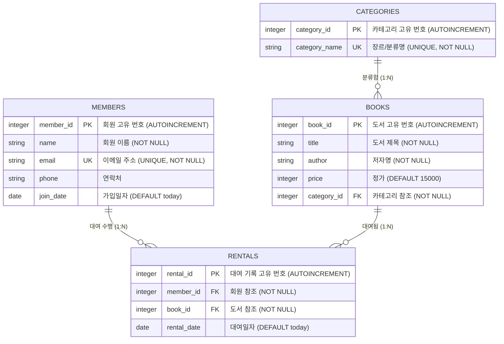

# 📊 SQL로 만드는 나만의 데이터베이스: 도서 관리 시스템 (Book Management System)

본 프로젝트는 **SQL 기반 도서 관리 시스템** 구축 및 분석 실습 결과물입니다. 백엔드 프레임워크 없이 표준 SQL과 SQLite를 활용하여 도메인 모델링, 참조 무결성(PK/FK) 제약조건 설정, 1:N 관계 설계, 데이터 입력, 핵심 쿼리 16선 및 보너스 분석 보고서를 완성했습니다.

---

## 📂 1. 제출물 구성 (Deliverables)

```text
sql-db/
├── schema.sql           # [1] 스키마 생성 DDL 스크립트 (PK, FK, UNIQUE, NOT NULL 제약조건 포함)
├── data.sql             # [2] 샘플 데이터 DML 스크립트 (테이블당 10행 이상)
├── queries.sql          # [3] 핵심 SQL 쿼리 16선 + 보너스 과제 쿼리
├── generate_results.py  # DB 실행 및 결과 자동화 생성 Python 스크립트
├── run.sh               # 전체 자동 실행 쉘 스크립트
├── mission12.db         # 생성된 SQLite 데이터베이스 파일
├── results/             # [4] 쿼리 실행 결과 폴더
│   ├── query_results.txt# 전체 쿼리 실행 결과 종합 텍스트 보고서
│   ├── Q01.txt ~ Q16.txt# 개별 쿼리 실행 결과
│   ├── Bonus_01A.txt ~ Bonus_03C.txt
│   └── Bonus_02.txt     # 데이터 무결성 에러 발생 테스트 및 해결 텍스트
└── README.md            # [5] 데이터베이스 설계 및 수행 종합 리포트
```

---

## 🏗 2. 도메인 모델링 및 ER-Diagram

본 시스템은 **회원(members)**, **카테고리(categories)**, **도서(books)**, **대여(rentals)**의 4개 테이블로 구성되며, 다음과 같은 1:N 관계 3개를 가지고 있습니다.

- `categories (1) : books (N)` — 한 카테고리에 여러 도서가 속함
- `members (1) : rentals (N)` — 한 회원이 여러 번 대여를 수행함
- `books (1) : rentals (N)` — 한 도서가 여러 번 대여될 수 있음

### ER-Diagram (Mermaid)



---

## 🛠 3. 테이블 설계 및 제약조건 (Schema & Constraints)

### 주요 적용 제약조건
1. **Primary Key (PK)**: 모든 테이블에 `INTEGER PRIMARY KEY AUTOINCREMENT` 적용.
2. **Foreign Key (FK)**:
   - `books.category_id` ➔ `categories.category_id`
   - `rentals.member_id` ➔ `members.member_id`
   - `rentals.book_id` ➔ `books.book_id`
   - `PRAGMA foreign_keys = ON;`으로 참조 무결성을 강제함.
3. **NOT NULL**: 필수 입력 항목 (`name`, `email`, `category_name`, `title`, `author`, `category_id`, `member_id`, `book_id`)
4. **UNIQUE**: 중복 방지 컬럼 (`members.email`, `categories.category_name`)

---

## 📋 4. 핵심 SQL 쿼리 16선 요약

| 분류 | ID | 쿼리 개요 | 사용 문법 / 기술 |
|---|---|---|---|
| **기본 조회 (4개)** | Q01 | 전체 도서 목록 제목순 정렬 상위 5권 | `ORDER BY`, `LIMIT` |
| | Q02 | 2026년 2월 이후 가입 회원 목록 | `WHERE`, `ORDER BY` |
| | Q03 | 저자명에 '로버트'가 포함된 도서 검색 | `WHERE LIKE` |
| | Q04 | Gmail 사용하는 회원 목록 3명 | `WHERE LIKE`, `LIMIT` |
| **조인 (5개)** | Q05 | 도서 제목과 카테고리명 조인 | `INNER JOIN` |
| | Q06 | 대여 상세 이력 (회원, 도서, 카테고리, 대여일) | 3개 테이블 `INNER JOIN` |
| | Q07 | 'IT/프로그래밍' 카테고리 도서 조인 | `INNER JOIN`, `WHERE` |
| | Q08 | 전체 카테고리 및 도서 (미보유 카테고리 포함) | `LEFT JOIN` |
| | Q09 | 전체 회원 및 대여 기록 (미대여 회원 포함) | `LEFT JOIN` |
| **집계/통계 (3개)**| Q10 | 카테고리별 보유 도서 수량 집계 | `COUNT`, `GROUP BY` |
| | Q11 | 회원별 대출 건수 집계 및 최다 대출 회원 TOP 3 | `COUNT`, `GROUP BY`, `LIMIT` |
| | Q12 | 카테고리별 도서 평균가 및 총 재고 금액 | `SUM`, `AVG`, `COUNT`, `GROUP BY` |
| **서브쿼리 (1개)** | Q13 | 한 번도 대여된 적 없는 미대여 도서 조회 | 서브쿼리 (`NOT IN`) |
| **수정/삭제 (2개)** | Q14 | 특정 회원('정창석') 연락처 변경 | `UPDATE` |
| | Q15 | 대여 기록 없는 임시 미대여 도서 삭제 | `DELETE`, 서브쿼리 |
| **인덱스 (1개)** | Q16 | `books.category_id` 외래키 컬럼 인덱스 생성 | `CREATE INDEX` |

---

## 🎁 5. 보너스 과제 (Bonus Tasks)

### 1. 조인 1개를 두 방식으로 풀기 (JOIN vs 서브쿼리)
- **요구사항**: 'IT/프로그래밍' 카테고리에 속한 도서 목록 조회
- **JOIN 방식**:
  ```sql
  SELECT b.title, b.author 
  FROM books b 
  JOIN categories c ON b.category_id = c.category_id 
  WHERE c.category_name = 'IT/프로그래밍';
  ```
- **서브쿼리 방식**:
  ```sql
  SELECT title, author 
  FROM books 
  WHERE category_id = (SELECT category_id FROM categories WHERE category_name = 'IT/프로그래밍');
  ```
- **차이 비교**:
  - **가독성**: 서브쿼리는 조건절에 단일 결과를 대입하므로 구문이 단순하지만, JOIN 방식은 테이블 간 관계를 명시적으로 표현합니다.
  - **성능/실행계획**: 인덱스가 존재하는 실무 RDBMS 환경에서는 Optimizer가 JOIN 시 인덱스 스캔을 효율적으로 활용하므로 복잡한 멀티 테이블 조회 시 JOIN이 유리합니다.

### 2. 데이터 정합성 깨뜨려 보기 (FK 에러 테스트)
- **에러 시도**:
  ```sql
  INSERT INTO rentals (member_id, book_id, rental_date) VALUES (999, 1, '2026-08-01');
  ```
- **발생 원인**: `members` 테이블에 `member_id = 999`인 부모 레코드가 존재하지 않으므로 SQLite의 외래키 제약조건(`FOREIGN KEY constraint failed`)이 작동하여 입력을 차단함.
- **해결 방안**: 부모 테이블(`members`)에 999번 회원을 먼저 생성(INSERT)하거나, 존재하는 회원 ID를 지정해야 참조 무결성이 유지됩니다.

### 3. 미니 리포트 - 핵심 지표 3선
1. **인기 도서 TOP 3**: `클린 코드`(3회), `부자 아빠 가난한 아빠`(2회), `사피엔스`(1회)가 최다 대여 도서로 집계됨.
2. **카테고리별 자산 가치**: `역사`(50,000원), `자연과학`(47,000원), `경제/경영`(42,000원) 순으로 높은 자산 비중을 차지함.
3. **회원 서비스 참여율**: 전체 회원 10명 중 9명이 대여 이력을 보유하여 **90.0%의 활성 참여율**을 기록함.

---

## ⚡ 6. 실행 방법 (How to Run)

### 쉘 스크립트로 일괄 실행
```bash
cd sql-db
./run.sh
```

### 결과 확인
생성된 실행 결과 텍스트 파일은 `results/query_results.txt` 및 `results/*.txt`에서 확인하실 수 있습니다.