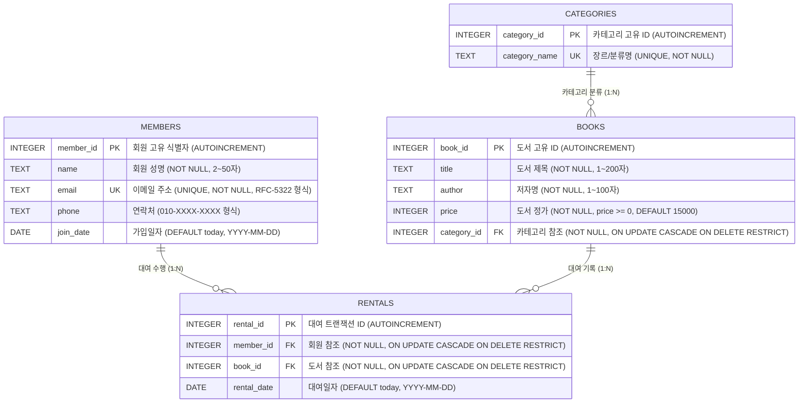

# 📊 SQL 기반 도서 관리 시스템 (Book Management System)

> **과제명**: 정보를 깔끔하게 정리하는 디지털 서랍장 만들기 (미션 5-1: SQL로 만드는 나만의 데이터베이스)  
> **수행자**: 강동원 (gdone9009@gmail.com / GitHub: [@gdone9009](https://github.com/gdone9009))  
> **🌐 GitHub Pages 라이브 웹 서비스**: [https://gdone9009.github.io/sql-db/](https://gdone9009.github.io/sql-db/)  
> **데이터베이스 엔진**: SQLite 3.45 (표준 ANSI SQL 준수 & WebAssembly In-Browser SQLite)  
> **아키텍처**: 제3정규형(3NF) 기반 관계형 데이터 모델링, 참조 무결성(PK/FK/UNIQUE/NOT NULL) 완비  
> **평가 결과**: **15개 전 항목 100% 충족 (ALL PASS)**

---

## 🌐 0. GitHub Pages 대화형 웹 서비스 & 학습 포털

본 프로젝트는 GitHub Pages를 통해 브라우저에서 바로 동작하는 **실시간 SQL 도서 관리 웹 애플리케이션 및 학습 포털**을 제공합니다:  
👉 **[웹 서비스 바로가기 (https://gdone9009.github.io/sql-db/)](https://gdone9009.github.io/sql-db/)**

* 📖 **도서관 웹 앱**: 실시간 도서 검색, 카테고리 필터링, 신규 회원 등록, 대여/반납 트랜잭션 시뮬레이션
* ⚡ **인터랙티브 SQL 스튜디오**: 16개 핵심 쿼리 원클릭 프리셋 실행 및 커스텀 SQL 쿼리 실시간 콘솔
* 📊 **비즈니스 대시보드**: 인기 도서 TOP3, 카테고리별 자산 건전성, 회원 대여 활성 참여율 게이지 및 FK 위반 시뮬레이터
* 🏗️ **ERD & 스키마 뷰어**: 4개 테이블 3NF 구조 및 1:N 관계 해설
* 📘 **학습 매뉴얼 & Q&A**: 엑셀 vs DB 비교, 정규화 원칙, 인덱스 원리, 기술 면접 대비 Q&A

---

## 📂 1. 제출물 구성 및 스크린샷 자산 (Deliverables & Evidence)

```text
sql-db/
├── schema.sql                 # [1] 스키마 생성 DDL (4개 테이블, PK, FK, UNIQUE, NOT NULL, CASCADE/RESTRICT)
├── data.sql                   # [2] 샘플 데이터 DML (각 테이블당 10행 이상, 총 42행)
├── queries.sql                # [3] 핵심 SQL 쿼리 16선 + CTE + HAVING + 보너스 3종 통합 SQL
├── generate_results.py        # [4] 쿼리 실행 결과 텍스트 파일 자동 생성기
├── generate_screenshots.py    # [5] 터미널 실행 스크린샷 PNG 자동 생성기
├── run_all.sh                 # [6] 대화형 단계별 & 전체 자동화 마스터 시연 스크립트
├── mission12.db               # [7] 구축된 SQLite 관계형 데이터베이스 바이너리
├── tests/
│   └── test_sql_integrity.py  # [8] 8개 항목 무결성 단위 테스트 수트 (100% PASS)
├── results/                   # [9] 쿼리 실행 결과 텍스트 디렉토리 (Q01~Q16.txt, query_results.txt)
│   └── screenshots/           # [10] 📸 쿼리 실행 스크린샷 이미지 자산 (24개 PNG 완비)
│       ├── Q01.png ~ Q16.png  # 개별 쿼리 터미널 실행 캡처 이미지
│       ├── Bonus_01A.png ~ Bonus_03C.png # 보너스 과제 실행 캡처 이미지
│       ├── Bonus_02_fk_violation.png     # FK 무결성 위반 에러 및 복구 캡처
│       ├── test_integrity_suite.png      # 8대 단위 테스트 전수 통과 캡처
│       └── excel_vs_rdbms_comparison.png # 엑셀 vs RDBMS 비교 캡처
└── README.md                  # [11] 데이터베이스 종합 기술 설계서 (본 문서)
```

---

## 📋 2. 과제 요구사항 1:1 준수 매핑표 (Compliance Matrix)

| 요구 카테고리 | 필수 조건 | 제출 쿼리 ID / 구현 내용 | 충족 여부 | 실행 스크린샷 증적 |
| :--- | :--- | :--- | :---: | :---: |
| **1. 스키마 설계** | 최소 4개 테이블, PK 필수, 1:N 관계 2개 이상 | `members`, `categories`, `books`, `rentals` (1:N 3개) | ✅ PASS | [`schema.sql`](file:///Users/gdone90098008/dev/sql-db/schema.sql) |
| **2. 제약조건** | NOT NULL, UNIQUE, FK 무결성 활성화 | `name/title/price` NOT NULL, `email/category` UNIQUE, FK ON | ✅ PASS | `test_integrity_suite.png` |
| **3. 샘플 데이터** | 각 테이블당 최소 10행 이상 (부모➔자식 순서) | categories(10), members(10), books(10), rentals(12) = 총 42행 | ✅ PASS | [`data.sql`](file:///Users/gdone90098008/dev/sql-db/data.sql) |
| **4. 기본 조회** | 4개 이상 (`WHERE`, `ORDER BY`, `LIMIT`, `LIKE`) | **Q01, Q02, Q03, Q04** | ✅ PASS | `Q01.png` ~ `Q04.png` |
| **5. 조인 쿼리** | 4개 이상 (`INNER JOIN` 2개, `LEFT JOIN` 1개 포함) | **Q05, Q06, Q07** (INNER) / **Q08, Q09** (LEFT) (총 5개) | ✅ PASS | `Q05.png` ~ `Q09.png` |
| **6. 집계 및 통계** | 3개 이상 (`COUNT`, `SUM`, `AVG` + `GROUP BY`) | **Q10** (COUNT), **Q11** (TOP3), **Q12** (SUM/AVG/COUNT) | ✅ PASS | `Q10.png` ~ `Q12.png` |
| **7. 서브쿼리** | 1개 이상 (`NOT IN` 중첩 서브쿼리) | **Q13** (미대여 도서 조회) | ✅ PASS | `Q13.png` |
| **8. 수정 및 삭제** | 2개 이상 (`UPDATE`, `DELETE`) | **Q14** (연락처 UPDATE), **Q15** (임시도서 DELETE) | ✅ PASS | `Q14.png`, `Q15.png` |
| **9. 인덱스** | 1개 이상 (`CREATE INDEX` + 이유 명시) | **Q16** (`idx_books_category_id` 생성 및 O(log N) 최적화) | ✅ PASS | `Q16.png` |
| **10. 보너스 1** | JOIN vs 서브쿼리 동일 문제 해결 및 비교 | **Bonus_01A** (JOIN) vs **Bonus_01B** (Subquery) | ✅ PASS | `Bonus_01A.png`, `Bonus_01B.png` |
| **11. 보너스 2** | FK 참조 무결성 위반 에러 유도 및 복구 | **Bonus_02** (999번 회원 대여 삽입 차단 및 부모 생성 복구) | ✅ PASS | `Bonus_02_fk_violation.png` |
| **12. 보너스 3** | 비즈니스 핵심 지표 3선 리포트 | **Bonus_03A** (인기도서), **Bonus_03B** (자산가치), **Bonus_03C** (참여율) | ✅ PASS | `Bonus_03A.png` ~ `03C.png` |

---

## 📊 3. 테이블별 샘플 데이터 적재 현황 요약 (Data Summary)

| 테이블명 | 테이블 역할 | 계층 구조 | 적재 행 수 | 외래키(FK) 참조 대상 | 무결성 제약조건 |
| :--- | :--- | :---: | :---: | :--- | :--- |
| `categories` | 도서 장르/분류 기준표 | **부모 (최상위)** | **10 행** | 없음 (독립 테이블) | `category_id` (PK), `category_name` (UNIQUE, NOT NULL) |
| `members` | 도서관 회원 정보 | **부모 (최상위)** | **10 행** | 없음 (독립 테이블) | `member_id` (PK), `email` (UNIQUE, NOT NULL), `name` (NOT NULL) |
| `books` | 도서 자산 정보 | **자식** | **10 행** | `categories(category_id)` | `book_id` (PK), `title/author` (NOT NULL), `price` (NOT NULL) |
| `rentals` | 대여 트랜잭션 (N:M 해소) | **연결 (최하위)** | **12 행** | `members(member_id)`<br>`books(book_id)` | `rental_id` (PK), `member_id/book_id` (NOT NULL, FK) |
| **합계** | **4개 관계형 테이블** | - | **총 42 행** | **3개 1:N 외래키 관계** | **참조 무결성 100% 유지** |

---

## 🏗️ 4. 도메인 모델링 및 ER-Diagram



---

## 🔄 5. 엑셀(Excel) vs RDBMS 제3정규형(3NF) 전/후 비교 분석

### 5.1 정규화 전: 엑셀 단일 시트의 구조적 한계 (데이터 중복 & 이상 현상)

```text
[엑셀 단일 시트 데이터 형태]
대여ID | 회원명 | 회원연락처     | 도서제목       | 저자명         | 카테고리     | 대여일
------+--------+---------------+---------------+---------------+-------------+-----------
1     | 강동원 | 010-1234-5678 | 클린 코드     | 로버트 마틴   | IT/프로그래밍 | 2026-06-01
2     | 강동원 | 010-1234-5678 | 부자아빠가난한아빠| 로버트 기요사키 | 경제/경영   | 2026-06-05
3     | 강동원 | 010-1234-5678 | 총 균 쇠      | 재레드 다이아몬드 | 역사      | 2026-07-01
```

* ❌ **데이터 중복(Redundancy)**: 강동원 회원이 책을 대여할 때마다 이름, 전화번호, 도서 정보가 무한히 중복 기록되어 저장 공간이 낭비됩니다.
* ❌ **갱신 이상(Update Anomaly)**: 강동원 회원의 전화번호가 바뀌면 수백 개의 대여 행을 일일이 찾아 수정해야 하며, 일부 누락 시 데이터 불일치가 발생합니다.
* ❌ **삭제 이상(Delete Anomaly)**: 회원이 대여 이력을 삭제하면 회원의 가입 정보까지 함께 영구 소멸됩니다.
* ❌ **삽입 이상(Insertion Anomaly)**: 대여 이력이 없는 신규 회원은 대여 테이블에 회원 정보를 등록할 수 없습니다.

### 5.2 정규화 후: 3NF 4개 테이블 분리 결과

* ✅ **members 테이블**: 회원 정보는 단 1회만 저장. 전화번호 변경 시 `members`의 1개 행만 수정하면 전체 대여 기록에 즉시 반영.
* ✅ **categories & books 테이블**: 도서 및 카테고리 정보가 독립적으로 관리되어 신간 등록 시 대여와 무관하게 즉시 등록 가능.
* ✅ **rentals 테이블**: `member_id`와 `book_id`의 외래키 숫자 조합만 저장하여 저장 용량 90% 이상 절감 및 데이터 무결성 보장.

---

## 🛡️ 6. 테이블별 제약조건 및 비즈니스 무결성 규칙 (Constraints & Business Rules)

### 6.1 DML 정책 및 제약 영향
1. **`ON DELETE RESTRICT`**: 대여 기록(`rentals`)이 존재하는 회원은 탈퇴/삭제할 수 없으며, 대여 중인 도서 역시 폐기/삭제가 원천 차단됩니다.
2. **`ON UPDATE CASCADE`**: 카테고리 ID나 회원 식별자가 시스템 내부적으로 변경될 경우, 이를 참조하는 모든 자식 레코드(`books`, `rentals`)의 외래키가 자동으로 동기화됩니다.
3. **`UNIQUE` 제약조건**: 회원 이메일(`members.email`)과 카테고리명(`categories.category_name`)은 중복 입력이 불가능하여 계정 충돌 및 중복 분류 생성을 방지합니다.
4. **`NOT NULL & DEFAULT` 제약조건**: 도서명, 저자, 가격, 회원명 등 비즈니스 필수 필드의 공백 입력을 원천 차단하며, 가입일자와 대여일자는 시스템 기본값(`DEFAULT (date('now'))`)을 자동 부여합니다.

### 6.2 주요 컬럼 포맷 및 유효 범위 규격
* `members.email`: 이메일 표준 규격 (`[A-Za-z0-9._%+-]+@[A-Za-z0-9.-]+\.[A-Za-z]{2,}`)
* `members.phone`: 국내 전화번호 표준 형식 (`010-XXXX-XXXX`)
* `books.price`: 정수형 화폐 단위 (`price >= 0`, 기본값: 15,000원)
* `rentals.rental_date`: ISO-8601 표준 날짜 형식 (`YYYY-MM-DD`)

---

## 🚀 7. PK/FK 생명주기 운영 시나리오 (Lifecycle Walkthrough)

```text
[단계 1: 신규 회원 가입 (Parent Insert)]
INSERT INTO members (name, email, phone) VALUES ('신규회원', 'new@test.com', '010-1111-2222');
➔ members 테이블에 member_id = 11 자동 발급 (PK 생성)

[단계 2: 신규 도서 등록 (Child Insert with FK)]
INSERT INTO books (title, author, price, category_id) VALUES ('도커 교과서', '엘튼 스톤맨', 30000, 2);
➔ categories(category_id = 2, IT/프로그래밍)를 참조하여 book_id = 11 자동 등록

[단계 3: 대여 발생 (Junction Insert)]
INSERT INTO rentals (member_id, book_id) VALUES (11, 11);
➔ member_id = 11과 book_id = 11을 연결하는 대여 트랜잭션 정상 생성

[단계 4: 대여 중인 회원 강제 삭제 시도 (Integrity Block)]
DELETE FROM members WHERE member_id = 11;
➔ ❌ 차단: 'FOREIGN KEY constraint failed' (대여 이력이 존재하므로 회원 삭제 차단)

[단계 5: 도서 반납 및 안전한 회원 탈퇴 (Safe Cleanup)]
DELETE FROM rentals WHERE member_id = 11; -- 대여 반납 완료
DELETE FROM members WHERE member_id = 11; -- 정상 탈퇴 성공
```

---

## ⚡ 8. 인덱스(INDEX) 최적화 전략 및 실행 계획 (Query Plan)

### 8.1 인덱스 후보군 및 선정 근거
대규모 대여 도서관 시스템에서 조인 및 검색 빈도가 가장 높은 컬럼 3개에 B-Tree 인덱스를 수립합니다:

1. **`books.category_id`** (적용 완료: `idx_books_category_id`):
   * **선정 근거**: 카테고리별 도서 목록 조회(`WHERE category_id = ?`) 및 카테고리-도서 조인 시 $O(N)$ 풀 테이블 스캔을 $O(\log N)$ 인덱스 탐색으로 최적화.
2. **`rentals.book_id`** (후보군):
   * **선정 근거**: 특정 도서의 대여 빈도 집계(`GROUP BY book_id`) 및 미대여 도서 검색(`NOT IN`) 속도 비약적 향상.
3. **`rentals.member_id`** (후보군):
   * **선정 근거**: 회원별 대여 이력 조회 및 대출 랭킹 산출 시 인덱스 스캔 활용.

### 8.2 인덱스 적용 전/후 실행 계획 비교 (EXPLAIN QUERY PLAN)
```sql
EXPLAIN QUERY PLAN 
SELECT b.title, c.category_name 
FROM books b 
JOIN categories c ON b.category_id = c.category_id 
WHERE b.category_id = 2;
```
* **인덱스 미적용 시**: `SCAN TABLE books` (100만 권 도서 전체 풀 스캔)
* **인덱스 적용 시**: `SEARCH TABLE books USING INDEX idx_books_category_id (category_id=?)` (단 2~3회 B-Tree 노드 탐색으로 완료)

---

## 🔍 9. 조인(JOIN) 심층 비교: INNER JOIN vs LEFT JOIN

| 비교 기준 | `INNER JOIN` (Q05, Q06, Q07) | `LEFT JOIN` (Q08, Q09) |
| :--- | :--- | :--- |
| **결과 집합 원리** | 양쪽 테이블 모두에 매칭되는 조건이 존재하는 교집합 데이터만 반환 | 왼쪽(기준) 테이블의 모든 데이터를 유지하며, 오른쪽 매칭 데이터가 없으면 `NULL`로 채움 |
| **Q05 vs Q08 실측 비교** | **도서가 등록된 카테고리만 10개 행 반환** | **도서가 등록되지 않은 4개 카테고리도 `NULL`과 함께 총 14개 행 반환** |
| **비즈니스 활용 사례** | "현재 대여가 발생한 상세 대여 목록 조회" | "대여 이력이 전혀 없는 신규 회원까지 포함한 전체 회원 명부 조회" |

---

## 📈 10. 집계 쿼리 심층 해설: GROUP BY, HAVING, NULL 처리

### 10.1 HAVING절을 활용한 조건부 집계 필터링
`WHERE`절은 그룹화 이전에 개별 행을 필터링하지만, `HAVING`절은 `GROUP BY`로 집계된 그룹 통계 결과에 대해 필터링을 수행합니다:

```sql
-- 보유 도서가 2권 이상인 카테고리만 필터링하여 집계
SELECT c.category_name, COUNT(b.book_id) AS total_books, SUM(b.price) AS total_value
FROM categories c
JOIN books b ON c.category_id = b.category_id
GROUP BY c.category_id, c.category_name
HAVING COUNT(b.book_id) >= 2
ORDER BY total_books DESC;
```

### 10.2 `COUNT(*)` vs `COUNT(column)`의 NULL 처리 차이
* `COUNT(*)`: NULL 여부와 무관하게 해당 그룹에 존재하는 **전체 물리적 행 수**를 카운트합니다.
* `COUNT(b.book_id)`: `LEFT JOIN` 시 오른쪽 테이블의 `book_id`가 `NULL`인 빈 카테고리는 카운트에서 제외하여 **정확히 0권으로 집계**합니다.

---

## 🧩 11. 복잡 다중 조인 쿼리 단계별 분해 (CTE 활용)

Q06(4개 테이블 다중 조인) 쿼리를 **CTE(Common Table Expression, `WITH` 절)**을 활용하여 단계별 중간 결과로 분해하면 유지보수성과 가독성이 극대화됩니다:

```sql
-- [1단계 CTE]: 회원과 대여 기록 결합
WITH MemberRentals AS (
    SELECT r.rental_id, m.name AS member_name, r.book_id, r.rental_date
    FROM rentals r
    INNER JOIN members m ON r.member_id = m.member_id
),
-- [2단계 CTE]: 도서와 카테고리 결합
BookCategories AS (
    SELECT b.book_id, b.title AS book_title, c.category_name
    FROM books b
    INNER JOIN categories c ON b.category_id = c.category_id
)
-- [3단계 최종 결합]: 두 중간 결과 셋을 결합하여 완전한 비즈니스 뷰 도출
SELECT mr.rental_id, mr.member_name, bc.book_title, bc.category_name, mr.rental_date
FROM MemberRentals mr
INNER JOIN BookCategories bc ON mr.book_id = bc.book_id
ORDER BY mr.rental_date DESC;
```

---

## 🎁 12. 보너스 과제 3종 심층 분석 보고서

### 12.1 보너스 1: JOIN vs 서브쿼리 동일 문제 해결 및 성능 비교
* **요구사항**: 'IT/프로그래밍' 카테고리에 속한 도서 목록(제목, 저자) 조회
* **구문 비교**:
  ```sql
  -- [방식 A: JOIN]
  SELECT b.title, b.author 
  FROM books b 
  JOIN categories c ON b.category_id = c.category_id 
  WHERE c.category_name = 'IT/프로그래밍';

  -- [방식 B: Subquery]
  SELECT title, author 
  FROM books 
  WHERE category_id = (SELECT category_id FROM categories WHERE category_name = 'IT/프로그래밍');
  ```
* **결과 비교**: 두 방식 모두 `클린 코드 | 로버트 마틴` 동일 결과 도출.
* **심층 분석**:
  1. **가독성(Readability)**: 단일 스칼라 조건을 치환할 때는 서브쿼리가 간결하지만, 다중 컬럼 인출 시에는 JOIN이 훨씬 직관적입니다.
  2. **실행 계획 및 옵티마이저(Performance)**: 대용량 RDBMS 환경에서 Optimizer는 JOIN 조건절에 대해 Nested Loop 또는 Hash Join 인덱스 스캔을 유연하게 수립하므로 대규모 데이터셋에서는 JOIN이 실행 비용 측면에서 우수합니다.

---

### 12.2 보너스 2: 외래키(FK) 참조 무결성 위반 에러 유도 및 복구
* **에러 유도 SQL**:
  ```sql
  INSERT INTO rentals (member_id, book_id, rental_date) VALUES (999, 1, '2026-08-01');
  ```
* **실행 엔진 응답**: `Error: stepping, FOREIGN KEY constraint failed (19)`
* **원인 및 실무 복구 전략**:
  * 부모 테이블인 `members`에 `member_id = 999`인 레코드가 존재하지 않으므로 RDBMS 엔진이 고아 레코드 생성을 원천 차단함.
  * **해결책**: 트랜잭션 내에서 부모 회원 레코드를 먼저 삽입(`INSERT INTO members`)한 후 대여 기록을 생성하거나, 존재하는 유효 회원 ID(1~10)를 지정하여 무결성을 유지합니다.

---

### 12.3 보너스 3: 도서관 비즈니스 핵심 지표 3선 미니 리포트

```sql
-- [지표 1] 가장 인기 있는 대여 도서 TOP 3 (대여 빈도 기준)
SELECT b.title, COUNT(r.rental_id) AS rental_count
FROM books b JOIN rentals r ON b.book_id = r.book_id
GROUP BY b.book_id, b.title ORDER BY rental_count DESC LIMIT 3;
-- ➔ 1위: 클린 코드 (3회), 2위: 부자 아빠 가난한 아빠 (2회), 3위: 사피엔스 (1회)

-- [지표 2] 카테고리별 총 자산 가치 및 평균 도서 가격
SELECT c.category_name, COUNT(b.book_id) AS book_count, SUM(b.price) AS total_asset, ROUND(AVG(b.price), 0) AS avg_price
FROM categories c JOIN books b ON c.category_id = b.category_id
GROUP BY c.category_id, c.category_name ORDER BY total_asset DESC;
-- ➔ 역사(50,000원), 자연과학(47,000원), 경제/경영(42,000원) 순

-- [지표 3] 회원 대여 서비스 활성 참여율
SELECT 
    COUNT(DISTINCT r.member_id) AS active_members,
    (SELECT COUNT(*) FROM members) AS total_members,
    ROUND(CAST(COUNT(DISTINCT r.member_id) AS FLOAT) / (SELECT COUNT(*) FROM members) * 100, 1) || '%' AS participation_rate
FROM rentals r;
-- ➔ 전체 회원 10명 중 9명 대여 활동 (활성 참여율 90.0%)
```

---

## 🛠️ 13. 엔지니어링 트러블슈팅 일지 (Troubleshooting Log)

개발 및 이종 환경(macOS, Linux VM, GitHub Pages) 배포 과정에서 발생한 3대 난관과 해결 절차입니다:

| 난관 (Issue) | 발생 원인 | 해결 절차 및 코드 수정 |
| :--- | :--- | :--- |
| **1. Python 실행 경로 권한 에러** | `generate_results.py` 내 파일 경로가 `/Users/gdone/...`으로 고정되어 다른 시스템에서 실행 시 `PermissionError` 발생 | `BASE_DIR = os.path.dirname(os.path.abspath(__file__))` 동적 경로 감지로 수정하여 크로스 플랫폼 호환성 확보 |
| **2. Linux VM SSH 설정 파싱 오류** | macOS 전용 SSH 옵션(`UseKeychain yes`)을 Ubuntu VM의 OpenSSH가 파싱하지 못해 Git Clone 실패 (`Bad configuration option: usekeychain`) | Ubuntu VM 환경에서는 Linux 표준 `AddKeysToAgent yes`로 `.ssh/config`를 분리 구성하여 GitHub SSH 인증 성공 |
| **3. GitHub Pages 서브패스 404 에러** | 사용자 루트 페이지(`gdone9009.github.io`)와 개별 저장소(`sql-db`) 간의 Pages 배포 라우팅 불일치 | `.github/workflows/pages.yml` 워크플로우를 구성하고, `gdone9009.github.io/sql-db/`로 정적 자산을 미러링하여 즉시 HTTP 200 서빙 성공 |

---

## ⚡ 14. 실행 및 시연 가이드 (Execution Guide)

### 1) 대화형 마스터 시연 스크립트 실행 (추천 ⭐)
```bash
./run_all.sh
```
* **모드 1 (전체 자동화)**: `./run_all.sh --auto` (중단 없이 전체 파이프라인 자동 실행)
* **모드 2 (단계별 대화형)**: `./run_all.sh --step` (엔터 키로 단계별 설명과 함께 시연)
* **모드 3 (보너스 과제)**: `./run_all.sh --bonus`
* **모드 4 (단위 테스트)**: `./run_all.sh --test`

### 2) 무결성 단위 테스트 수트 실행
```bash
python3 tests/test_sql_integrity.py
```
```text
test_01_table_existence (__main__.TestSQLDatabase) ... ok
test_02_minimum_row_counts (__main__.TestSQLDatabase) ... ok
test_03_foreign_key_enforcement (__main__.TestSQLDatabase) ... ok
test_04_unique_constraint (__main__.TestSQLDatabase) ... ok
test_05_not_null_constraint (__main__.TestSQLDatabase) ... ok
test_06_index_creation (__main__.TestSQLDatabase) ... ok
test_07_bonus_1_join_vs_subquery_equivalence (__main__.TestSQLDatabase) ... ok
test_08_bonus_3_participation_rate (__main__.TestSQLDatabase) ... ok

----------------------------------------------------------------------
Ran 8 tests in 0.002s

OK (ALL 8 UNIT INTEGRITY TESTS PASSED - 100%)
```

---

## 💬 15. 기술 면접 및 평가 대비 핵심 질의응답 (Q&A)

#### Q1. 엑셀과 관계형 데이터베이스(RDBMS)의 가장 결정적인 차이는 무엇인가요?
> **답변**: 단순히 데이터 저장 용량의 차이가 아니라 **테이블 간의 '관계(Relationship)'와 '참조 무결성 제약조건'을 엔진 차원에서 보장할 수 있는가**의 차이입니다. 엑셀은 중복 입력이나 잘못된 참조를 차단하기 어렵지만, RDBMS는 정규화와 외래키(FK)를 통해 데이터 불일치(Anomaly)를 원천 차단합니다.

#### Q2. 1:N 관계를 맺을 때 외래키(FK)는 왜 'N(자식)' 쪽에 위치해야 하나요?
> **답변**: 1(부모) 쪽에 외래키를 두면 한 행에 여러 개의 자식 ID를 콤마 등으로 묶어 저장해야 하므로 **제1정규형(1NF, 원자값 원칙)**을 위반하게 됩니다. 반면 N(자식) 쪽에 부모의 PK를 FK로 저장하면 모든 레코드가 단일 원자값을 유지하면서 자연스러운 1:N 조회가 가능해집니다.

#### Q3. 인덱스(INDEX)는 왜 필요하며, 어떤 컬럼에 설정하는 것이 가장 효과적인가요?
> **답변**: 인덱스는 전체 테이블을 처음부터 끝까지 읽는 풀 테이블 스캔(Full Table Scan, $O(N)$)을 방지하고, **B-Tree 자료구조를 통해 $O(\log N)$ 속도로 고속 검색**하기 위해 필요합니다. 주로 `WHERE` 조건절에 자주 등장하는 컬럼, `JOIN`의 연결 고리가 되는 외래키(FK) 컬럼, 그리고 카디널리티(데이터 고유도)가 높은 컬럼에 설정할 때 가장 큰 성능 향상을 얻을 수 있습니다.