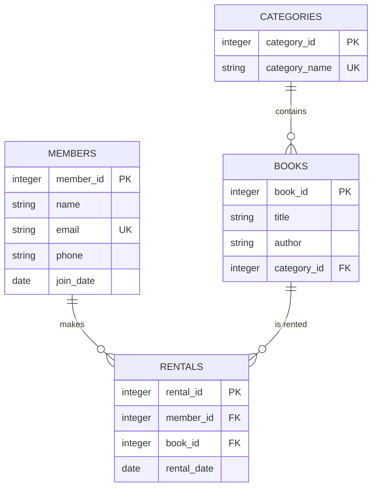

# 📊 도서 관리 시스템 데이터베이스(SQL-DB) 구축 리포트

본 프로젝트는 **Codyssey AI All-in-One** 과정의 미션 12를 수행한 결과물로, SQLite를 활용하여 관계형 데이터베이스의 핵심 원리인 참조 무결성(FK)과 데이터 분석(SQL)을 실습한 기술 문서입니다.

---

## 📂 1. 시스템 아키텍처 및 ER-Diagram

데이터의 효율적인 관리와 중복 방지를 위해 총 4개의 테이블로 정규화하여 설계하였습니다.

### [ER-Diagram 구조]

```text
  [Members] (회원)          [Categories] (장르)
  - member_id (PK)  <--.    - category_id (PK)
  - name               |    - category_name
  - email (Unique)     |           |
  - join_date          |           | (1:N)
                       |           v
                       |      [Books] (도서)
  [Rentals] (대여)      |---   - book_id (PK)
  - rental_id (PK)     |      - title
  - member_id (FK) >---'      - author
  - book_id (FK)   >---------- - category_id (FK)
  - rental_date

```

---

## 🛠 2. 테이블 설계 상세 (Schema)

데이터의 일관성을 유지하기 위해 다음과 같은 제약 조건을 적용했습니다.

### 주요 제약 조건 (Constraints)

* **Primary Key & AUTOINCREMENT**: 각 레코드에 고유 번호를 부여하고 자동 생성합니다.
* **Foreign Key (FK)**: 부모 테이블에 없는 ID가 자식 테이블에 등록되는 것을 차단하여 **참조 무결성**을 보장합니다.
* **Unique & Not Null**: 이메일 중복을 방지하고 필수 정보(이름, 제목 등) 누락을 막습니다.

---

## ⚡ 3. 쿼리 최적화 기법 (Alias & Join)

복잡한 데이터 관계를 효율적으로 조회하기 위해 테이블 별칭(Alias)을 사용했습니다.

| 별칭 | 대상 테이블 | 활용 이유 |
| --- | --- | --- |
| **m** | members | 회원 정보(이름, 이메일) 호출 시 사용 |
| **b** | books | 도서 상세 정보와 연결 시 사용 |
| **r** | rentals | 대여 이력 및 날짜 계산의 중심 |
| **c** | categories | 장르별 통계 산출 시 기준점으로 사용 |

---

## 📈 4. 비즈니스 인사이트 (미니 리포트)

SQL 쿼리를 통해 도서관 운영에 필요한 핵심 지표 3가지를 도출했습니다.

### ① 가장 인기 있는 도서 TOP 3 (인기 지표)

`JOIN`과 `GROUP BY`를 사용하여 대여 횟수가 가장 많은 도서를 산출합니다.

```sql
SELECT b.title, COUNT(r.rental_id) AS total_rentals
FROM books b
JOIN rentals r ON b.book_id = r.book_id
GROUP BY b.book_id ORDER BY total_rentals DESC LIMIT 3;

```

### ② 장르별 도서 보유 현황 (재고 지표)

`LEFT JOIN`을 활용해 도서가 0권인 카테고리까지 모두 포함한 현황을 파악합니다.

```sql
SELECT c.category_name, COUNT(b.book_id) AS book_count
FROM categories c
LEFT JOIN books b ON c.category_id = b.category_id
GROUP BY c.category_id;

```

### ③ 데이터 정합성 검증 (보안 지표)

존재하지 않는 회원 번호(999)로 대여를 시도할 때, DB 엔진이 **FK 제약 조건**에 의해 입력을 거부하는 것을 확인했습니다. (참조 무결성 증명)

---

## 🤖 5. 실행 자동화 가이드 (Automation)

작업 효율성을 극대화하기 위해 통합 실행 환경을 구축했습니다.

### 통합 실행 파일 (`init.sql`)

하나의 명령어로 전체 데이터베이스를 재구축하고 분석 결과를 확인합니다.

```bash
# 실행 명령어
sqlite3 mission12.db ".read init.sql"

```

### 가상 테이블 (`VIEW`) 운영

자주 조회하는 '대여 현황' 쿼리를 `VIEW`로 저장하여 코드 재사용성을 높였습니다.

* **View Name**: `v_rental_status`
* **장점**: 복잡한 Join 문을 매번 작성할 필요 없이 일반 테이블처럼 조회 가능.

---

## 🏁 6. 결론 및 기대 효과

이번 실습을 통해 단순한 데이터 나열이 아닌, 관계(Relation)를 통한 데이터 관리의 중요성을 학습했습니다. 이는 향후 **FastAPI**와 같은 백엔드 프레임워크에서 데이터베이스를 연동할 때 탄탄한 기초 자산이 될 것입니다.

## 🏗 1. 데이터 구조 설계 (ER-Diagram)

본 시스템은 회원, 도서, 카테고리, 대여 기록 간의 유기적인 관계를 바탕으로 설계되었습니다.

